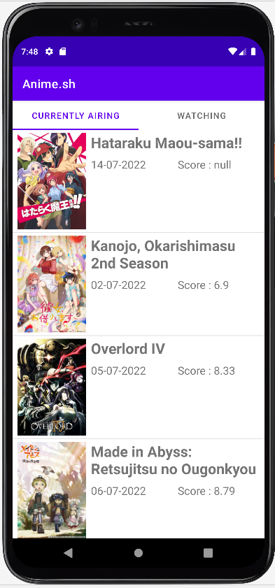
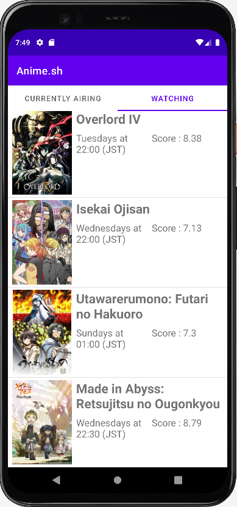
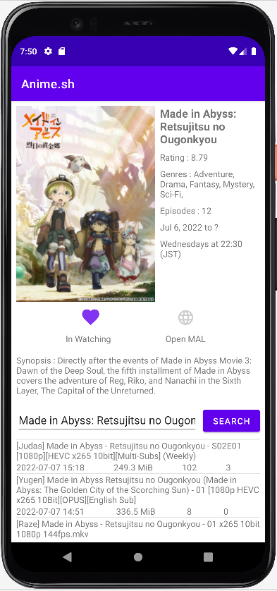
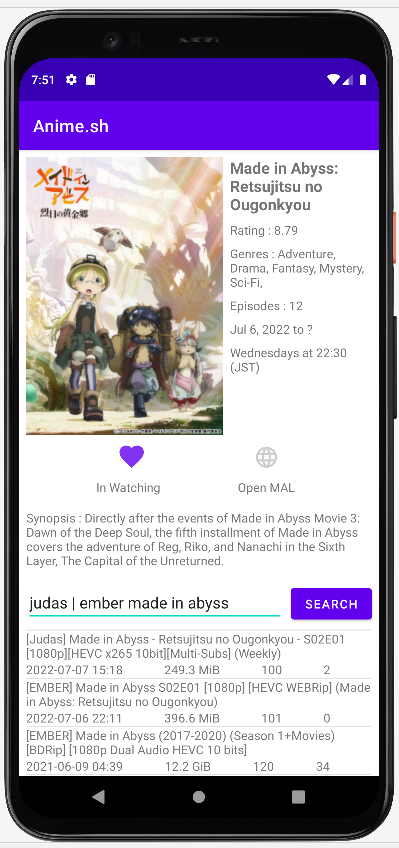

# anime.sh
A simple Android App to track currently airing anime shows.
Made using jikan.moe, nyaa.si and Glide.

Get the latest build in release/[verison] folder.

If you encounter "Play Protect doesn't recognise this app's developer. Apps from unknown developers can sometimes be unsafe." and cannot install this app,
You can probably fix it by turning off Play Protect in Google Play Store.
