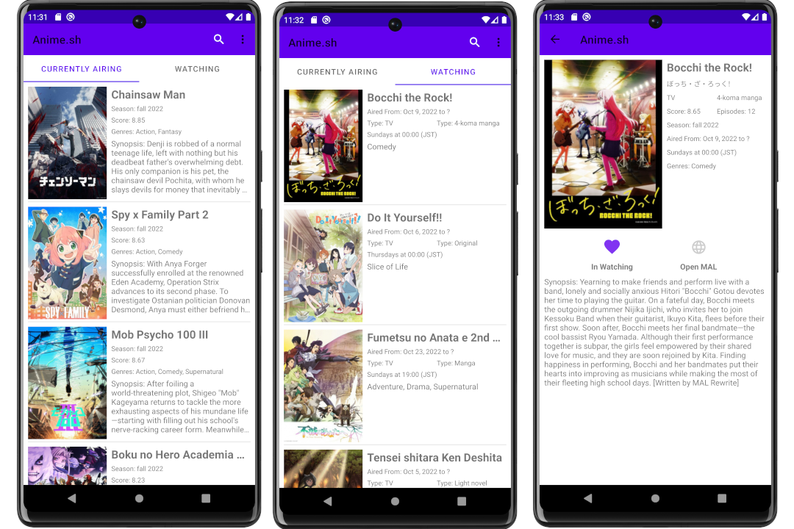

# anime.sh
A simple Android App to track currently airing anime shows.
Made using jikan.moe, retrofit and glide.

Get the latest release (https://github.com/seinwaihtut/anime.sh/releases/tag/v1.0.0)

You can ignore the Google Protect's warning message when sideloading the App.